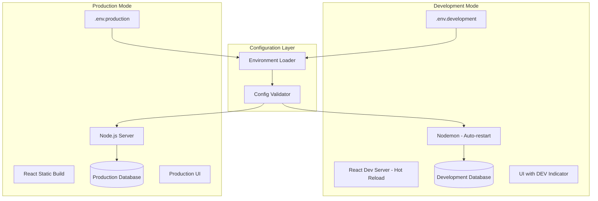

# Design Document: Development Environment

## Overview

This design establishes a development environment configuration for the Baseball PWA application that enables developers to preview and test changes locally before deploying to production. The solution leverages environment-specific configuration files, hot-reloading tools, and visual indicators to create a clear separation between development and production modes.

## Architecture



## Components and Interfaces

### 1. Environment Configuration Loader

**Purpose**: Load the appropriate environment configuration based on NODE_ENV.

**Interface**:
```javascript
// config/environment.js
module.exports = {
  loadEnvironment: () => Config,
  validateConfig: (config) => ValidationResult,
  getEnvironmentName: () => string
}
```

**Behavior**:
- Checks NODE_ENV value (development, production)
- Loads corresponding .env file (.env.development or .env.production)
- Falls back to .env if specific file not found
- Validates required variables are present

### 2. Development Indicator Component

**Purpose**: Display visual indicator when running in development mode.

**Interface**:
```javascript
// client/src/components/DevIndicator.js
<DevIndicator /> // Renders "DEV" badge when NODE_ENV !== 'production'
```

### 3. Enhanced Server Startup

**Purpose**: Log environment information and database connection details on startup.

**Behavior**:
- Log current NODE_ENV value
- Log database name being connected to
- Display clear startup banner with environment info

## Data Models

### Configuration Schema

```javascript
{
  // Server
  PORT: number,
  NODE_ENV: 'development' | 'production',
  
  // Database
  DB_HOST: string,
  DB_USER: string,
  DB_PASSWORD: string,
  DB_NAME: string,
  DB_PORT: number,
  
  // Authentication
  JWT_SECRET: string,
  SESSION_SECRET: string,
  GOOGLE_CLIENT_ID: string,
  GOOGLE_CLIENT_SECRET: string,
  GOOGLE_CALLBACK_URL: string,
  
  // URLs
  CLIENT_URL: string
}
```

### Required Variables (for validation)

```javascript
const REQUIRED_VARS = [
  'PORT',
  'NODE_ENV',
  'DB_HOST',
  'DB_NAME',
  'JWT_SECRET',
  'SESSION_SECRET',
  'CLIENT_URL'
];
```

## Correctness Properties

*A property is a characteristic or behavior that should hold true across all valid executions of a system-essentially, a formal statement about what the system should do. Properties serve as the bridge between human-readable specifications and machine-verifiable correctness guarantees.*

Based on the prework analysis, most acceptance criteria for this feature are configuration and integration tests rather than properties that can be verified through property-based testing. The feature primarily involves:
- File loading (external I/O)
- Process management (npm scripts, nodemon)
- UI rendering (visual indicators)
- Database connections (integration)

### Property 1: Configuration Validation Completeness

*For any* configuration object, if any required variable is missing, the validation function SHALL return a failure result listing all missing variables.

**Validates: Requirements 1.4**

This is the primary testable property - we can generate random configuration objects with various combinations of present/missing fields and verify the validator correctly identifies all missing required fields.

## Error Handling

### Missing Environment File
- Log warning: "Environment file .env.{mode} not found, falling back to .env"
- Continue with default .env file
- Do not crash the application

### Missing Required Variables
- Log error listing all missing variables
- Exit process with code 1
- Display clear message: "Missing required environment variables: [list]"

### Database Connection Failure
- Log error with database name: "Failed to connect to database: {DB_NAME}"
- Include connection details (host, port) in error message
- Retry connection with exponential backoff (optional)

## Testing Strategy

### Unit Tests
- Test configuration validator with various input combinations
- Test environment name detection logic
- Test DevIndicator component renders correctly based on environment

### Property-Based Tests
- **Property 1**: Use fast-check to generate random configuration objects and verify validation catches all missing required fields

### Integration Tests (Manual)
- Verify `npm run dev` starts both servers
- Verify hot-reloading works for frontend changes
- Verify nodemon restarts on backend changes
- Verify correct database is used per environment

### Testing Framework
- Jest for unit tests
- fast-check for property-based testing (JavaScript PBT library)
- React Testing Library for component tests
